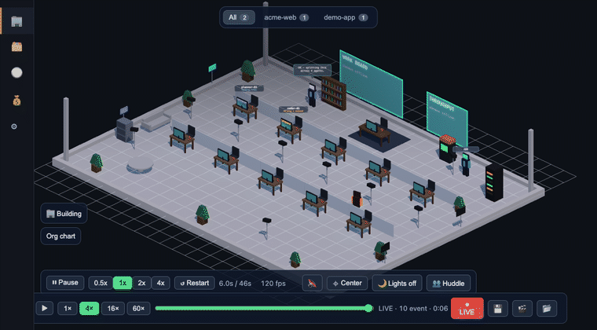
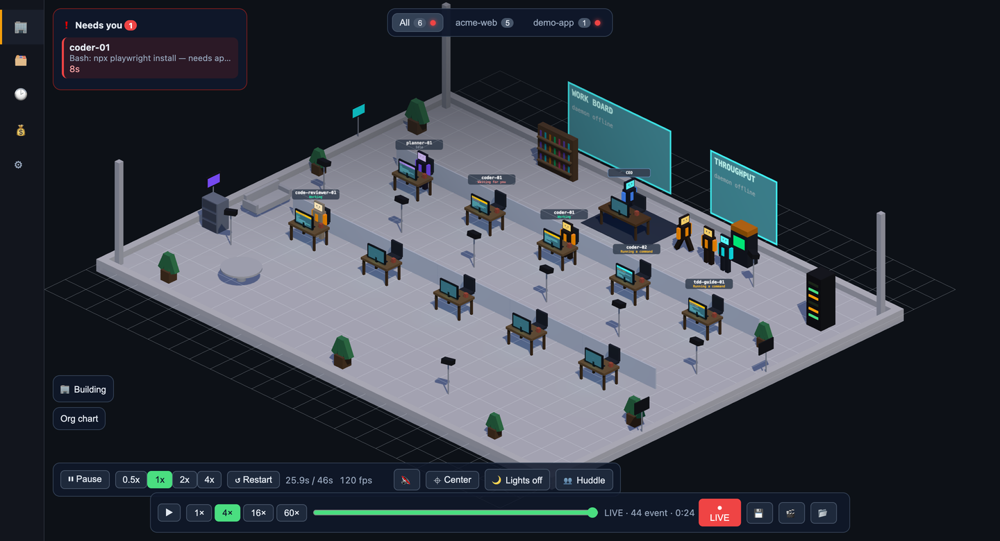
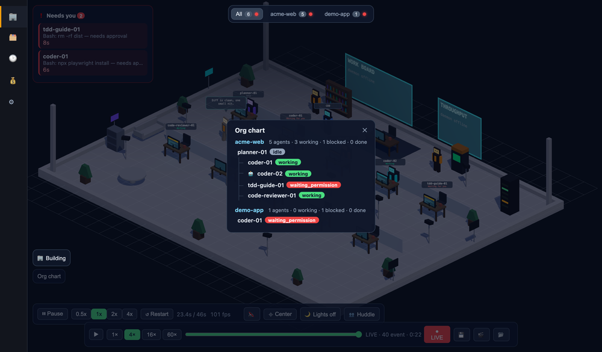
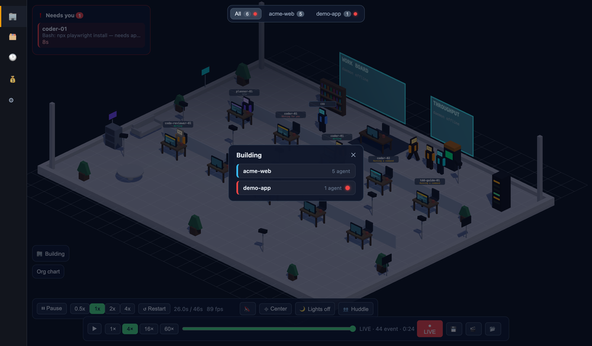
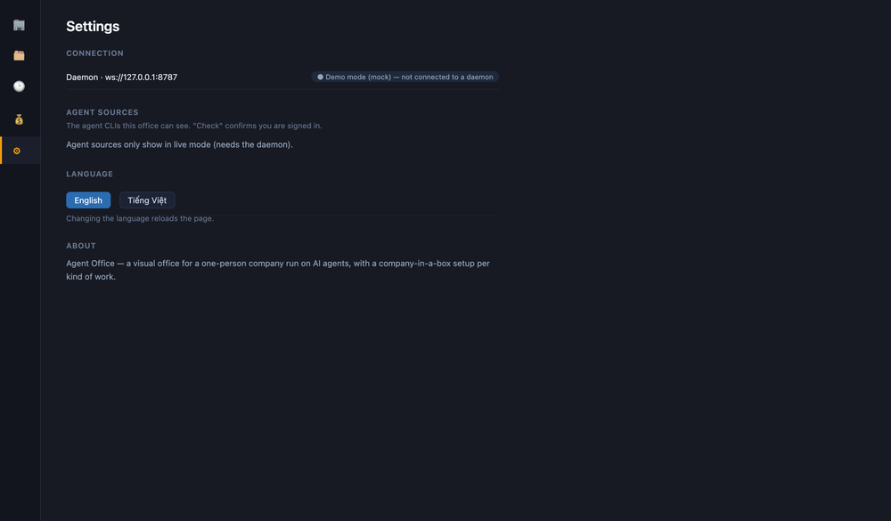

# Agent Office

**English** · [Tiếng Việt](README.vi.md)

[](https://github.com/h3nryprod01/agent-office/actions/workflows/ci.yml)
[](LICENSE)
[](https://nodejs.org)

Your coding-agent sessions, rendered as a live isometric office.

Every character below is a **real agent session** running on this machine — walking to the bookshelf to read files, hammering the arcade machine to run commands, and raising a red ❗ when it needs you.



## Why

Terminal logs answer *"what happened?"*. Agent Office exists to answer a different question, **faster than the terminal**: *"where do I need to intervene?"*

Two principles drive every decision here:

- Real data + real-time is the soul of the product.
- Ugly graphics with true data **beat** pretty graphics with fake data.

## Quick start

Requires Node 20+.

```bash
git clone https://github.com/h3nryprod01/agent-office && cd agent-office
./scripts/start.sh
```

That installs dependencies, builds the renderer, installs the daemon as a login agent (it starts at login and restarts itself if it crashes), and opens **http://localhost:8787** — your currently running sessions appear as characters within seconds.

Re-run `./scripts/start.sh` whenever you like: it rebuilds and reuses the daemon that's already running. One process, one port, always the current build.

> Open it at `localhost`, not `127.0.0.1`. Browsers treat those as separate origins with separate permissions, and the microphone grant that voice input needs does not carry across.

No live sessions? Add `?mock=1` for a scripted scenario, and `?stress=30` for a perf test with 30 extra characters.

**Windows:** `powershell -ExecutionPolicy Bypass -File scripts\start.ps1` — the same thing. Parsed and dry-run clean on pwsh; the Scheduled Task and browser-open steps are Windows-only and unrun there. See [docs/install.md](docs/install.md).

**Linux:** `./scripts/install-ubuntu.sh` — systemd `--user` service, starts at boot.

**Prefer an icon to a terminal?** `./scripts/make-app.sh` builds a double-clickable *Agent Office.app* into `~/Applications`.

**Developing the renderer?** `npm --prefix packages/renderer run dev` serves it on **http://localhost:5199** with hot reload, talking to the same daemon.

Logs, troubleshooting, and uninstall: **[docs/install.md](docs/install.md)**.

## What you actually get

### The office



Characters spawn per session and walk between stations. Where someone is standing tells you what they are doing without reading a word: **desk** = editing, **bookshelf** = reading files, **arcade machine** = running commands, **meeting table** = delegating to sub-agents.

Multiple repos become multiple office tabs, and a red ❗ over a character means it is stuck.

### Who is waiting on whom



Sub-agents get their own characters, linked back to whoever spawned them. The org chart overlay is the same information as a tree, with a live count of who is working, blocked, and done.

### Every repo at once



The building view puts each repo on its own floor. Click one to jump to that office. The intervention queue reaches **across** offices — an alert in a repo you aren't looking at still surfaces, and clicking it switches tab and pans the camera.

### Settings, and the language



The office speaks **English by default and Vietnamese on request** — it follows your browser's preference and remembers what you pick.

## Architecture

```
DATA SOURCES (read-only, non-invasive)
  ~/.claude/projects/**/*.jsonl             Claude Code transcripts (root + sub-agents)
  ~/.codex/sessions/**/rollout-*.jsonl      Codex CLI
  ~/.gemini/tmp/**                          Gemini CLI
  ~/.claude/agent-office-hook-events.jsonl  hooks (optional, for instant signals)
        │ tail + normalize into one event stream
        ▼
  packages/daemon (plain Node; the only dependency is `ws`)
        │ WebSocket + HTTP on localhost:8787
        ▼
  packages/renderer (three.js isometric office and UI)
```

The event protocol lives in `packages/protocol`. The daemon is the only writer and the renderer is a pure consumer, so a new harness is an adapter, not a rewrite.

## What works today

**Seeing what your agents are doing** — tails **Claude Code, Codex CLI, and Gemini CLI**, normalized into one stream. Sub-agents get their own characters. Many repos become many office tabs.

**Acting on it** — a needs-attention queue lists blocked, waiting and errored agents and pans the camera to them; OS notifications fire when one gets stuck; a permission prompt raises ❗ on the character and can be approved from the office or from Telegram; a per-repo PM agent you can chat with (by voice, if you like); a spend dashboard across all three harnesses.

**Running agents as a team** — `templates/` holds "company in a box" setups: a roster of agent roles plus goals, which you can list, inspect, apply, and save back.

## Status

A working tool, used daily by its author, still a personal project rather than a product. Known limits:

- **Localhost only, no authentication** — read [SECURITY.md](SECURITY.md) before exposing the port anywhere.
- Spend in USD is only complete for models with published pricing; others count tokens but not dollars rather than guessing.
- Animation pauses in hidden browser tabs (browsers stop `requestAnimationFrame`); state stays correct and characters catch up when the tab is visible.
- `waiting_permission` is instant with the optional hook pilot, and inferred from the transcript without it.
- Text-to-speech for PM replies needs a local virtualenv; without it the feature is simply off.

Test suite: 560 tests across 55 files, run on Node 20 and 22 in CI.

## Roadmap

1. **Aquarium** — passively visualize your own sessions. ✅
2. **Mission Control** — inspect a character, see who's blocked, jump to who needs you. ✅
3. **Open protocol** — one adapter per harness behind a shared schema. ✅ (Claude Code, Codex, Gemini)

Next: a public protocol document so third parties can add harnesses without reading the daemon's source.

## Repo structure

- `packages/daemon/` — data pipeline: transcript + hook tailers → event stream
- `packages/renderer/` — three.js isometric renderer and UI
- `packages/protocol/` — event protocol (JSON schema)
- `templates/` — "company in a box" agent rosters
- `docs/` — specs, semantic mapping, and a status note per feature ([index](docs/README.md))
- `assets/` — art, with sources and licenses in [assets/CREDITS.md](assets/CREDITS.md)

## Contributing

Issues welcome, including "this didn't work on my machine". Replies are best-effort — this is a spare-time project. Please open an issue before building anything substantial. See [CONTRIBUTING.md](CONTRIBUTING.md).

## License

MIT — see [LICENSE](LICENSE). Third-party art is CC0; see [assets/CREDITS.md](assets/CREDITS.md) for per-asset attribution.
