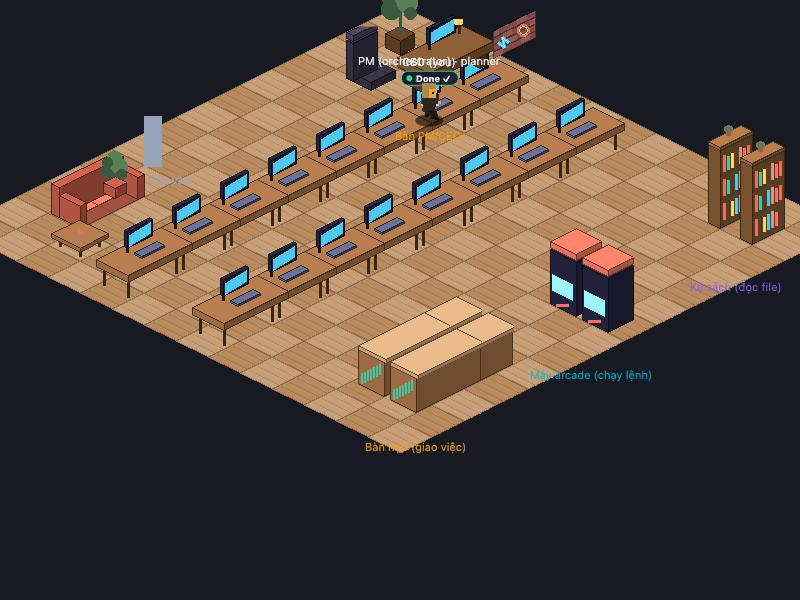
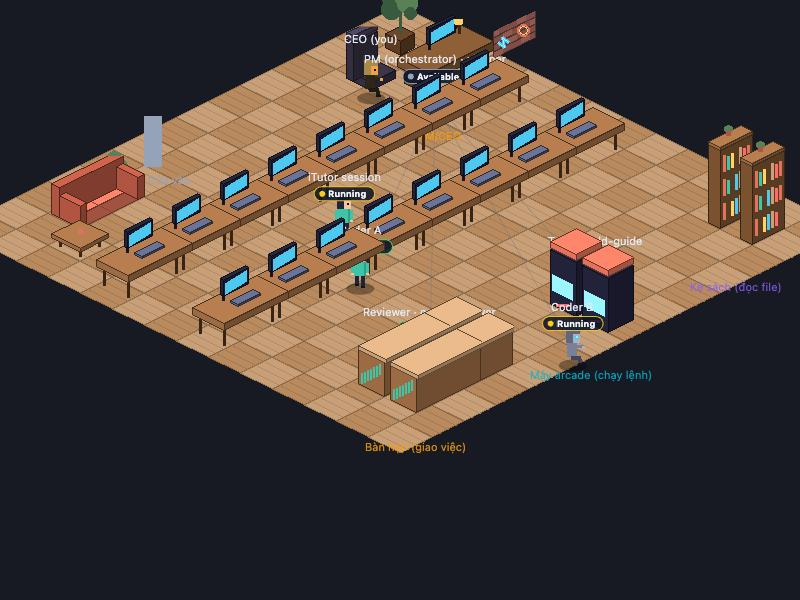

# Art Round 3 — Animation upgrade + fix vị trí CEO (`wi-anim-round3`)

_Anim engineer, 2026-07-08. Branch `feat/anim-round3`._

## 1. Bug fix: CEO ngồi sai chỗ (root cause)

**Triệu chứng**: "CEO (you)" đứng đè lên dãy bàn thường phía trên thay vì ngồi ở cụm bàn CEO.

**Root cause**: 3 nơi hardcode vị trí cụm CEO lệch nhau:

| Nơi | Giá trị cũ | Vấn đề |
|---|---|---|
| `layout.ts CEO_CHAIR` | `{3.1, 2.2}` | Trùng đúng cột slot đứng của dãy bàn thường (`deskSlot(0)` = `{3.1, 2}`) |
| `layout.ts CEO_QUEUE_SLOTS` | cột `gx 3.1` | Hàng chờ duyệt đứng đè lên slot bàn của agent đang làm việc |
| `main.ts PM_DESK` | `{1.5, 1.5}` hardcode riêng | Trùng CEO_SPOT nhưng là bản copy, không có ràng buộc |

**Fix**: `layout.ts` là MỘT nguồn chân lý cho cả cụm — `CEO_DESK` (bàn), `CEO_CHAIR` (ghế exec, CEO ngồi đúng tile `chair_exec_E`), `CEO_SPOT` (PM đứng cạnh bàn), `CEO_QUEUE_SLOTS` (derive từ `CEO_DESK`, xếp trước bàn, tránh cột slot bàn thường). DECOR dùng chung các const này; `main.ts` import `CEO_SPOT` thay vì hardcode. Test regression trong `test/anim.test.ts` khóa invariant "ghế CEO/queue không bao giờ dính slot bàn thường".

| Before | After |
|---|---|
|  |  |

Before: CEO đứng trên dãy bàn, ghế exec (góc trên trái) trống. After: CEO ngồi đúng ghế tại bàn walnut; nhân vật đứng sau dãy bàn bị bàn che nửa thân dưới (z-sort mới).

## 2. Animation upgrade (visual-only, không đổi reducer/state/protocol)

1. **Walk cycle**: tween ease-in-out (`easeInOutQuad`) thay lerp tuyến tính; đủ 4 hướng walk từ art round 2; **fix mới**: đến nơi thì `stopWalking()` quay về pose đúng của status — trước đây nhân vật đứng "đi tại chỗ" cho tới lần đổi status kế tiếp.
2. **Idle fidget**: nhân vật idle/done thỉnh thoảng (3–8s random) liếc trái/phải bằng frame walk đứng yên ~0.5s rồi quay lại idle. Không đồng loạt (phase per-agent).
3. **Spawn/despawn có lễ**: vào từ cửa → đi bộ đến bàn (giữ nguyên); **mới**: rời đi = đi bộ ra cửa rồi fade (cap 5s, quá thì fade tại chỗ). Time-lapse ≥4× vẫn teleport + fade ngay như cũ.
4. **Typing/working có nhịp**: gõ phím theo burst ~1.1s + nghỉ ~0.5s (`typingRhythm`), offset per-agent; badge trạng thái đổi màu có crossfade 200ms (`lerpColor`).
5. **Z-sorting + shadow**: nội thất (bàn/trạm/decor) chuyển vào depth container chung với nhân vật, zIndex = screen-y ⇒ nhân vật sau bàn bị che đúng; shadow ellipse dưới chân đã có từ trước, giữ nguyên. Sàn/cửa/label vẫn ở lớp dưới.
6. **Speech bubble pop**: scale 0.9→1 + alpha trong 120ms, pivot tại đuôi bubble; fade-out giữ như cũ.

Fallback graceful giữ nguyên: thiếu atlas → capsule Graphics, mọi tick animation đều no-op an toàn.

## 3. Hiệu năng (60fps với 30+ nhân vật)

Đo trên `?mock=1&stress=30` (36 agents), macOS, cùng máy:

| | FPS (samples 500ms) |
|---|---|
| Before (main) | 60, 60, 60, 60, 60, 60, 60, 60 |
| After (branch) | 60, 60, 60, 60, 60, 60, 60, 60, 60, 60 |

Vsync-capped 60fps ổn định cả hai phía; không regression. Chi phí thêm ~0 (zIndex assignment thay cho array sort mỗi tick; badge tween chỉ chạy 200ms mỗi lần đổi status).

## 4. Test & verify

- `tsc --noEmit` sạch; **119/119 test xanh** (13 test mới trong `test/anim.test.ts`: easing endpoints/monotonic, walkDirection, lerpColor, fidgetDelay/typingRhythm bounds, CEO-cluster regression, queue clamp).
- Verify runtime bằng preview: CEO sprite tại đúng `isoToScreen(CEO_CHAIR)`; despawn walk-out → fade → cull; arrival đứng với `idle_S` (không còn walk-in-place); depth container 37 children sortable.

## 5. Ghi chú

- `.claude/launch.json` thêm entry `anim-wt` (port 5301) để preview worktree — drop sau khi merge như tiền lệ `cost-wt`.
- Lưu ý dev: tab preview background hoá thì rAF dừng → office "đứng hình" là hành vi browser, không phải bug renderer.
