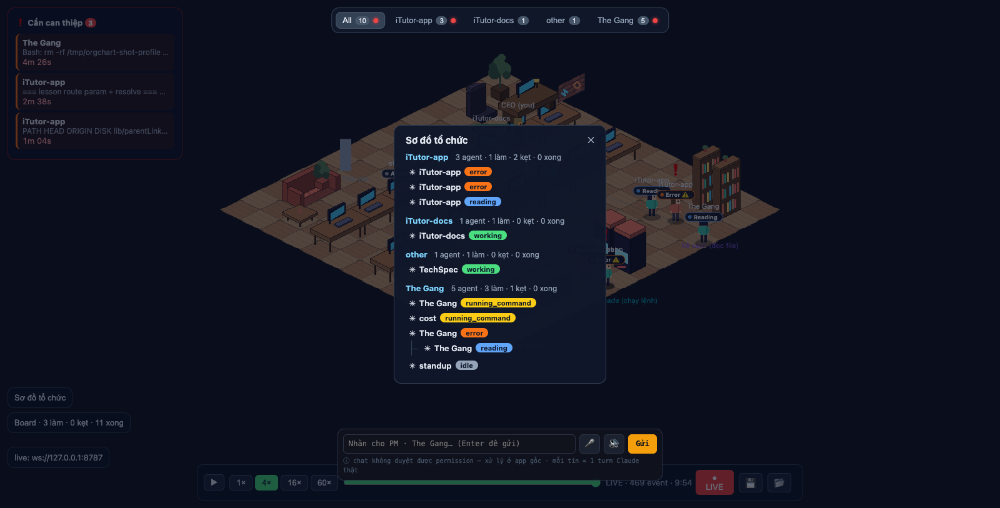

# wi-orgchart — Sơ đồ tổ chức sống (R7)

_Cập nhật: 2026-07-08 · branch `feat/orgchart` · session Orgchart Engineer_

## Là gì

Overlay "Sơ đồ tổ chức" trên tường văn phòng: ai spawn ai, nhìn một phát hiểu cấu trúc công ty. Root session = trưởng phòng, sub-agent = nhân viên dưới quyền, nhóm theo repo (phòng ban).

## Đã ship

- **Selector `orgForest`** ([selectors.ts](../packages/renderer/src/sim/selectors.ts)): từ `parentId` trên state agents build forest per repo — pure function, chỉ agent còn sống; orphan (parent không tồn tại / đã despawn / khác repo) → treat as root. Kèm đếm per repo: tổng agent, working (đang hoạt động), blocked (alert statuses), done.
- **Overlay UI** ([ui/orgchart.ts](../packages/renderer/src/ui/orgchart.ts)): nút "Sơ đồ tổ chức" cạnh Board; cây DOM/CSS thuần (indent + đường nối CSS, không thư viện graph). Mỗi node: harness icon (✳ Claude / 🤖 Codex) + tên + badge trạng thái màu (tái dùng `.status-chip`). Click node → đóng overlay + pan camera tới nhân vật + mở side panel (tái dùng cơ chế focus của intervention queue, extract thành `focusAgent` dùng chung trong main.ts).
- **Live update**: re-render 1.5s khi overlay mở; DOM chỉ rebuild khi cây đổi (signature check, cùng trick với queue panel — click không bao giờ rơi vào node vừa bị detach).
- **Lọc theo tab**: mở trong tab repo nào → mặc định cây repo đó; tab All → nhóm theo repo (sort alphabet).

## Verify thật (2026-07-08, daemon live ws://127.0.0.1:8787)

- `tsc --noEmit` sạch; **101/101 test xanh** (6 test mới cho `orgForest`: nest con/cháu, orphan → root, parent despawn → con lên root, loại despawned, đếm 4 bucket, nhóm per repo + parent khác repo).
- Mở overlay với 10–16 agent thật đang chạy (3 chip R7 + obsi-sync + demo-app sessions): cây hiển thị đúng, session của chính chip này có sub-agent con lồng dưới (spawn thật qua Agent tool để tạo data).
- Click node → overlay đóng, side panel mở đúng agent, camera pan (path `focusAgent` chung với intervention queue).
- Tab "Acme Web" → overlay chỉ hiện cây Acme Web; tab All → 4 repo.

## Giới hạn biết trước

- Cây chỉ hiện agent còn sống — agent despawn biến mất ngay cùng con của nó (con lên root). Lịch sử đầy đủ đã có ở replay/time-lapse.
- Re-render 1.5s là polling, không phải event-driven — đủ cho nhịp spawn/despawn thật, tránh re-render mỗi event.
