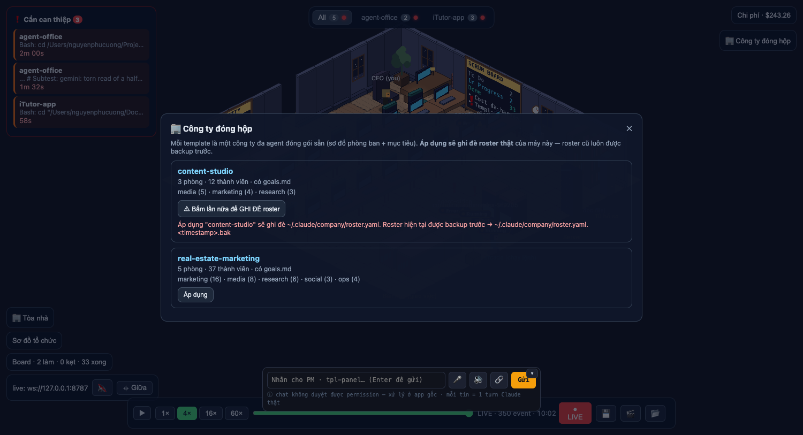

# Templates Panel — "🏢 Công ty đóng hộp" (wi-templates-panel)

Mặt tiền sản phẩm cho company template: trước đây template chỉ chạy được bằng CLI, giờ xem/áp được ngay trong office. Đây là màn hình demo khi bán "công ty đóng hộp".



## Kiến trúc

Logic thật nằm ở **`scripts/company-template-lib.mjs`** — CLI (`company-template.mjs`) và daemon dùng chung đúng một bản. Không có parser thứ hai, không có bản apply thứ hai.

| Nơi | Việc |
|-----|------|
| `scripts/company-template-lib.mjs` | `applyTemplate` / `resolveTemplateDir` / `templateMissingSkills`. Mọi đường dẫn là tham số (`templatesDir`, `companyDir`, `homeDir`) → test trỏ vào HOME giả, không đụng roster thật. |
| `packages/daemon/src/templates.js` | `GET /templates`, `POST /templates/apply`. Departments lấy từ `parseRoster` của `roster.js` (không viết parser mới). |
| `packages/renderer/src/ui/templates.ts` | Nút `🏢 Công ty đóng hộp` → overlay danh sách template + nút Áp dụng 2 bước. |

## API

**`GET /templates`** → mảng summary, đọc lại đĩa mỗi request (file nhỏ, cùng kỷ luật `/roster`):

```json
[{ "name": "content-studio",
   "departments": [{ "name": "media", "memberCount": 5 }],
   "memberTotal": 12, "hasGoals": true, "missingSkills": [] }]
```

Template hỏng bị **bỏ qua kèm warn**, không làm chết cả list. Thiếu `templates/` → `[]`.

**`POST /templates/apply {name}`** → `{ backupPath, missingSkills, goals }`.

1. Validate `name` — chỉ `^[a-z0-9-]+$` **và** phải là thư mục thật trong `templates/`. Sai → **400**, không sờ vào roster.
2. Backup roster hiện tại → `roster.yaml.<ISO-timestamp>.bak` (timestamp nên apply lần 2 không đè backup lần 1).
3. Copy `templates/<name>/roster.yaml` → `~/.claude/company/roster.yaml`.
4. Trả về skill thiếu + `goals.md`. **Không tự cài skill nào** — người dùng chạy skill `company-hire` (quét an toàn bắt buộc).

## An toàn

- **Path traversal**: `resolveTemplateDir` là chốt chặn duy nhất, cả CLI lẫn daemon đều đi qua. `../evil`, `abc/def`, `/etc/passwd`, `Studio`, `""`, `null`, số → 400. Lệnh `save` của CLI cũng được chặn bằng regex đó (trước đây `save ../x` ghi được ra ngoài `templates/`).
- **Ghi đè roster thật**: nút Áp dụng cần **2 lần bấm**. Lần 1 chỉ "lên nòng" và hiện rõ file sẽ bị đè + nơi backup; bấm sang template khác thì chuyển nòng chứ không apply nhầm công ty. Lần 2 mới gọi daemon.
- **XSS**: mọi chữ đến từ daemon (tên template, tên skill, `backupPath`, nội dung `goals.md`) vào DOM bằng `textContent`. `innerHTML` chỉ dùng cho khung tĩnh không nội suy.
- **Overlay**: `.tpl-overlay[hidden] { display: none }` — vào chung block với orgchart/hiring/outputs, tránh lại bug backdrop `display:flex` đè kín màn hình.

## Test

- **Daemon** `packages/daemon/test/templates.test.js` (7 test): list summary + goals + skill thiếu (member `source: "plugin ..."` coi như đã cài); `[]` khi thiếu `templates/`; bỏ qua template hỏng; apply ghi roster; apply backup roster cũ rồi mới đè; **8 tên xấu + 1 tên không tồn tại → 400 và roster giữ nguyên**; 405 + CORS preflight. Toàn bộ chạy trên `templatesDir`/`companyDir`/`homeDir` tạm — `npm test` không bao giờ chạm roster thật.
- **Renderer** `packages/renderer/test/templates.test.ts` (13 test): `summaryMeta`, `missingLabel`, `applyLines`, và máy trạng thái confirm `nextArm` (lần 1 arm, lần 2 apply, bấm template khác thì re-arm).
- Daemon 130/130 · renderer 202/202 · `tsc --noEmit` sạch.

## Còn lại

- Panel chỉ hiện ở live mode (apply cần daemon); mock mode ẩn hẳn nút.
- Sau khi merge phải **kickstart lại daemon service** — bản đang chạy chưa có route `/templates` (404).
- Chưa có nút `save` (đóng gói roster hiện tại thành template) trên UI — vẫn dùng CLI.
